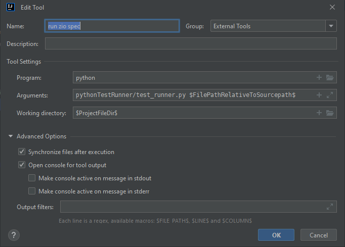

# zio2playground

A repo that covers 

1. Service layering in tests including shared layering. As mentioned there are some gotchas.
2. How to set up an external tool in intellij, this enables run a test without a plugin without 
   having to focus off a coding tab. 
3. Tracing through the application using OpenTelemetry, this enables Zipkin etc. This includes setting 
   current context from incoming headers. We want to keep the trace across system boundaries. 
   Not having this sort of stuff can make a fun day a much less than fun day.
4. How we log the trace in the logging, so we can get some kibana or similar goodness. This imlementation uses logback 
   as not everything is likely to be pure ZIO.log in an application. There is an example of monkeying around
   with the MDC in **LoggingSL4JExample**. This handles java util and direct SL4J logging which probably simulates a lot 
   of production environments. For example, I don't think a functionally pure version of PAC4J is on anyone's todo list. 
   Anything security based should be implemented as few times as possible, unless you like crackers.
    
   <br/>MDC stuff does have its limitations due to issues with copying between threads, ideally async
   is being done by the effect system and the java stuff is not async by nature.

   It is a bit hacky but an idea of how to do it, I had to hijack the zio package to read the fiber ref to get the 
   **zio.logging.logContext** where this is held.

   **B3TracingOps.serverSpan** creates a span and add it to the logging context.
   
5. ZIO.log does add to the MDC but only for that call. The logback.xml config adds all MDC
   to the log hence number **LoggingSL4JExample** is doing something similar for the java logging calls.


## Testing

Currently, tests kind of work in Intellij. They run as a main class which means things like shared 
services across tests behave very weird. Having the ZIO plugin would fix that but at this point in time
it is not ZIO2 compatible.

The instructions for sharing services across tests can be found in the following video.

**Zymposium - Sharing Expensive Services Across Specs**
https://www.youtube.com/watch?v=gzHStYNa6Og&t=878s

What happens when run as a main class is the shared service instantiates 3 times. This is easily 
verifiable in the **SharedLayerBaseSpec** where this is all detailed. Without a specific test 
runner intellij is doing the equivalent of :- 

```shell
sbt "Test/runMain com.github.pbyrne84.zio2playground.sharedlayer.TestA"
```

which outputs 

```shell
{
  "@timestamp": "2022-09-13T14:56:23.54+01:00",
  "@version": "1",
  "message": "created ExpensiveService class com.github.pbyrne84.zio2playground.sharedlayer.Expens  iveService Thread[ZScheduler-Worker-9,5,main]",
  "logger_name": "com.github.pbyrne84.zio2playground.sharedlayer.ExpensiveService",
  "thread_name": "ZScheduler-Worker-9",
  "level": "INFO",
  "level_value": 20000
}{
  "@timestamp": "2022-09-13T14:56:23.662+01:00",
  "@version": "1",
  "message": "created ExpensiveService class com.github.pbyrne84.zio2playground.sharedlayer.Expen  siveService Thread[ZScheduler-Worker-10,5,main]",
  "logger_name": "com.github.pbyrne84.zio2playground.sharedlayer.ExpensiveService",
  "thread_name": "ZScheduler-Worker-10",
  "level": "INFO",
  "level_value": 20000
}{
  "@timestamp": "2022-09-13T14:56:23.879+01:00",
  "@version": "1",
  "message": "created ExpensiveService class com.github.pbyrne84.zio2playground.sharedlayer.Expen  siveService Thread[ZScheduler-Worker-0,5,main]",
  "logger_name": "com.github.pbyrne84.zio2playground.sharedlayer.ExpensiveService",
  "thread_name": "ZScheduler-Worker-0",
  "level": "INFO",
  "level_value": 20000
}
```

while running 

```shell
sbt "Test/testOnly com.github.pbyrne84.zio2playground.sharedlayer.TestA"
```

outputs just one instance

```shell
{
  "@timestamp": "2022-09-13T14:57:44.966+01:00",
  "@version": "1",
  "message": "created ExpensiveService class com.github.pbyrne84.zio2playground.sharedlayer.ExpensiveServ  ice Thread[ZScheduler-Worker-5,5,main]",
  "logger_name": "com.github.pbyrne84.zio2playground.sharedlayer.ExpensiveService",
  "thread_name": "ZScheduler-Worker-5",
  "level": "INFO",
  "level_value": 20000
}
```

meaning the expensive service is only created once.

This can be a bit of a gotcha as it can be a bit confusing. It is nice to be able to run tests in isolation as it 
enables a debugger to be easily used as inheriting tests can be a variable affair. Worth keeping an eye on the 
GitHub projects

https://github.com/zio/zio-intellij/
and
https://github.com/zio/zio-test-intellij


### Using an intellij external tool to run tests
https://www.jetbrains.com/help/idea/settings-tools-external-tools.html

External tools allow you to set up custom operations to run from Intellij. They have a set of macros that can be 
passed to the external tool such as the line number $LineNumber$ or the file path relative to source path **$FilePathRelativeToSourcepath$**.
$FilePathRelativeToSourcepath$ is useful as we can calculate the test class to run from that and call sbt run that tests.



#### test_runner.py
This takes the argument passed from the external tool and if the file ends in Test or Spec runs that test. Else it runs the 
previous test. This is so you can write the tests first (like children who will get more than coal at Christmas), run the 
tests proving they fail, then switch to the implementation while running the tests without having to go back to the test
or command line. Keeping the flow. 

(CMD|CTRL)+shift+a opens the run action allowing you to type the name of the external tool and run it that way,
it remembers the last thing you typed, you can just open it again and press enter to retry. This is not as elegant 
as the usual shift+f10 or CMD+R which runs the last run action but still it is better than flicking around in 
panels or tabs needlessly. 

This is just an example, it is tied to being in a subfolder in this project purely because I needed to set up a python
sdk in a scala project as a submodule.

If you were really adventurous you could get the line number and search backwards for the test name and then only run 
that test case.

#### problems
This does not solve the problem of easily debugging though that could probably be done.


## Logging and tracing
We need a **spanFrom**  operation to initialise tracing with a starting value such as an incoming headers or to 
generate one if there is the headers do not exist.

e.g.
### Example from LoggingSL4JExample
```scala
// extension methods for ZIO (spanFrom in this case)
import zio.telemetry.opentelemetry.TracingSyntax.OpenTelemetryZioOps

val operations : ZIO[A,B,C]= ???

operations.spanFrom(
  propagator = DummyTracing.basicPropagator,
  carrier = List(
    DummyTracing.traceIdField -> "01115d8eb7e102b505085969c4aca859",
    DummyTracing.spanIdField -> "40ce80b7c43f2884"
  ),
  getter = DummyTracing.headerTextMapGetter,
  spanName = "span-name",
  spanKind = SpanKind.SERVER
)

```

### Initialisation of trace ids
Using open telemetry we have the following parts 

1. Carrier
2. TextMapPropagator
3. TextMapGetter

The carrier can be the source values that can potentially initialise the values. For example a list of headers. The
TextMapGetter is called by the TextMapPropagator to interface with the values and locate a possible value.

An example implementation of the TextMapPropagator is 

**B3PropagatorExtractorMultipleHeaders**

```scala
val propagator: TextMapPropagator = B3Propagator.injectingMultiHeaders()
```

accessed by the 

```java 
  public <C> Context extract(Context context, @Nullable C carrier, TextMapGetter<C> getter) {
    return Stream.<Supplier<Optional<Context>>>of(
            () -> singleHeaderExtractor.extract(context, carrier, getter),
            () -> multipleHeadersExtractor.extract(context, carrier, getter),
            () -> Optional.of(context))
        .map(Supplier::get)
        .filter(Optional::isPresent)
        .map(Optional::get)
        .findFirst()
        .get();
  }
```

call in the 
```java
B3Propagator
```

As we are using the multi header version this will scan the headers in the carrier looking for the following headers.
```scala
object B3 {
  object header {
    val traceId: String = "X-B3-TraceId"
    val spanId: String = "X-B3-SpanId"
    val sampled: String = "X-B3-Sampled"
  }
}
```

The actual constants are private so the ones above are versions local to the project. When looking for header values we 
should not care about case-sensitivity on names.

### Examples

#### Output from RoutesSpec

***B3TracingOps.serverSpan*** creates a new span then makes sure those values are added to the logger.
There is no magic like in Kamon so need to be aware that we may be creating spans, but they can be out of sync
with what is logged. Less magic is good in the sense that we can observe things.

You will see that parent span id f9550d1c8f78300b on the second entry relates to the span id on the first. 

```json
{
  "@timestamp": "2022-09-13T11:50:39.571+01:00",
  "@version": "1",
  "message": "received a called traced service call with the id 433",
  "logger_name": "com.github.pbyrne84.zio2playground.routes.Routes",
  "thread_name": "zio-default-blocking-4",
  "level": "INFO",
  "level_value": 20000,
  "span_name": "callTracedService",
  "parent_span_id": "72f449d2d1e23744",
  "trace_id": "f63279dda3c01ef3ef3bc27e2bb5c206",
  "span_id": "f9550d1c8f78300b"
}
```

```json
{
  "@timestamp": "2022-09-13T11:50:39.571+01:00",
  "@version": "1",
  "message": "calling http://localhost:50828/downstream/433",
  "logger_name": "com.github.pbyrne84.zio2playground.client.ExternalApiService",
  "thread_name": "zio-default-blocking-4",
  "level": "INFO",
  "level_value": 20000,
  "span_name": "ExternalApiService.callApi",
  "parent_span_id": "f9550d1c8f78300b",
  "trace_id": "f63279dda3c01ef3ef3bc27e2bb5c206",
  "span_id": "482156f6269286ab"
}
```

#### TracingClientSpec

This examples reading the current context and adding it to a client calls headers using ZIO layering to achieve this.
We are allowing the ids to be autogenerated. The reporter will complain it cannot talk to a real service, this is ignorable.

#### LoggingSL4JExample

This reads from a dummy TextMapPropagator and TextMapGetter found in DummyTracing. The carrier is a list of tuples 
with field names matching the expected field names. The sl4j bridge is being used as we have things doing logging 
via java util which is being handled by the **jul-to-slf4j** library.


##### ZIOHack.attemptWithMdcLogging
As the name suggest this a hack. It pretends to live in the world of the zio package which gives us the ability to 
write a custom zio attempt operation. The FiberRuntime has LogContext in it with all our logging goodies which we 
would like applied to logging calls via MDC ZIO has no control over.

```scala
// needed for util->sl4j logging
SLF4JBridgeHandler.install()

for {
   _ <- ZIOHack.attemptWithMdcLogging {
      javaUtilLogger.severe(s"util meowWithMdc $getThreadName")
   }
   _ <- ZIO.attempt {
      javaUtilLogger.severe(s"util meowWithNoMdcMdc $getThreadName")
   }
} yield ()
```
produces
```sh
{
  "@timestamp": "2022-09-13T15:23:09.539+01:00",
  "@version": "1",
  "message": "util meowWithMdc ZScheduler-Worker-4",
  "logger_name": "com.github.pbyrne84.zio2playground.logging.LoggingSL4JExample",
  "thread_name": "ZScheduler-Worker-4",
  "level": "ERROR",
  "level_value": 40000,
  "span_name": "banana2",
  "parent_span_id": "c234dec741f08fcb",
  "trace_id": "01115d8eb7e102b505085969c4aca859",
  "user_id": "user-id",
  "span_id": "20f2acf6460baf0c",
  "kitty": "kitty"
}{
  "@timestamp": "2022-09-13T15:23:09.541+01:00",
  "@version": "1",
  "message": "util meowWithNoMdcMdc ZScheduler-Worker-4",
  "logger_name": "com.github.pbyrne84.zio2playground.logging.LoggingSL4JExample",
  "thread_name": "ZScheduler-Worker-4",
  "level": "ERROR",
  "level_value": 40000
}
```
Note the MDC is flushed after the first call.

**Code that does the magic**
```scala
def attemptWithMdcLogging[A](code: => A)(implicit trace: Trace): Task[A] =
  ZIO.withFiberRuntime[Any, Throwable, A] { (fiberState: FiberRuntime[Throwable, A], _) =>
    // Logback implementation can return null
    val mdcAtStart = Option(MDC.getCopyOfContextMap)

    try {
      // Follows similar logic to FiberRuntime.log
      val logContext: LogContext = fiberState.getFiberRef(zio.logging.logContext)(Unsafe.unsafe)
      MDC.setContextMap(logContext.asMap.asJava)
      val result = code
      ZIO.succeedNow(result)
    } catch {
      case t: Throwable if !fiberState.isFatal(t)(Unsafe.unsafe) =>
        throw ZIOError.Traced(Cause.fail(t))
    } finally {
      MDC.setContextMap(mdcAtStart.orNull)
    }
  }
```
A more generified version that could be used.

```scala
  // version that uses a generified version to get things out the fiber but doesn't need to know all the dirty
  // details
  def attemptWithMdcLogging2[A](code: => A): Task[A] = {
    attemptWithFiberRef(zio.logging.logContext) { (logContext: LogContext) =>
      val mdcAtStart = Option(MDC.getCopyOfContextMap)
      try {
        MDC.setContextMap(logContext.asMap.asJava)
        code
      } finally {
        MDC.setContextMap(mdcAtStart.orNull)
      }
    }
  }

  // Something like this could be added as it is generic and doesn't require exposing internals
  def attemptWithFiberRef[A, B](fiberRef: FiberRef[A])(code: A => B): Task[B] = {
    ZIO.withFiberRuntime[Any, Throwable, B] { (fiberState, _) =>
      try {
        val refValue: A = fiberState.getFiberRef(fiberRef)(Unsafe.unsafe)

        val result = code(refValue)

        ZIO.succeedNow(result)
      } catch {
        case t: Throwable if !fiberState.isFatal(t)(Unsafe.unsafe) =>
          throw ZIOError.Traced(Cause.fail(t))
      }
    }
  }
```


**LogbackMDCAdapter** (There ain't no party like a null club party)

```java 
public Map<String, String> getCopyOfContextMap() {
    Map<String, String> hashMap = copyOnThreadLocal.get();
    if (hashMap == null) {
        return null;
    } else {
        return new HashMap<String, String>(hashMap);
    }
}
```


